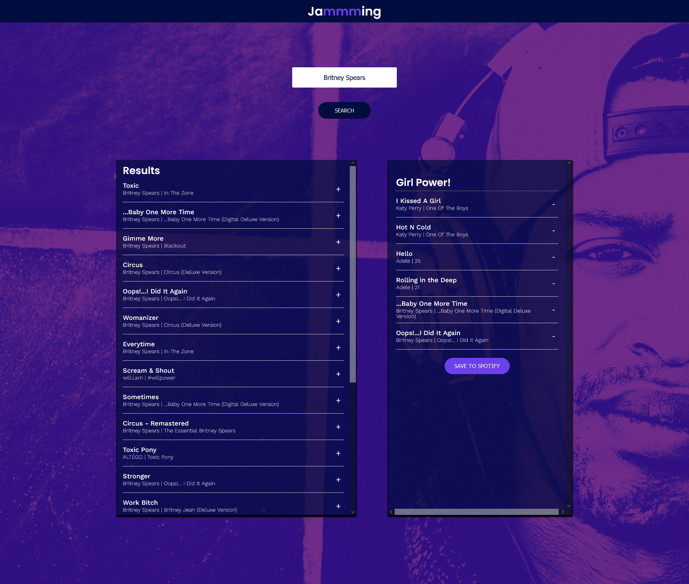

# Jammming React Project

A React project to allow users to search for songs on Spotify and create a new
playlist

## Usage/Examples

The purpose of this project was to practice react class components and utilise
skills learned to implement project

## Tech Stack

**Client:** React

## Authors

- [@haylzrandom](https://www.github.com/haylzrandom)

## Screenshots

## Roadmap

- Convert to functional compnents
- Include preview samples for each track
- Only display songs not currently present in playlist in the search results
- Add a loading screen while playlist saving
- Update acces token to expire at right time instead of when user initiates next
  search
- After redirect on login, restore search term from before redirect
- Stop page refreshing on first loading
- Ensure playlist info doesn't get cleared if access token needs to be refreshed
